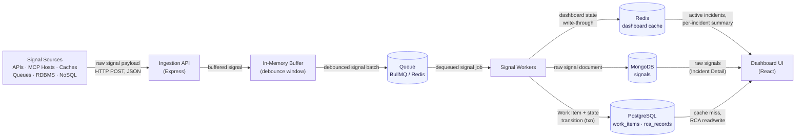

# InveniOps — Incident Management System (IMS)

## Overview

Distributed systems fail in pieces — a cache node degrades, a queue backs up, an RDBMS
connection pool exhausts — and each piece emits its own flood of error/latency signals
faster than a human can read them. InveniOps ingests those signals at high volume,
collapses repeated noise from the same failing component into a single trackable Work
Item, routes it to the right responder at the right severity, and enforces a workflow
that can't reach "Closed" without a documented root cause. The goal is to turn raw
signal noise into a small number of accountable incidents with a measurable
Mean Time To Repair.

## Architecture



See [docs/architecture.md](docs/architecture.md) for the write-path/read-path breakdown and
[docs/decisions/](docs/decisions/) for why each store holds what it holds.

## Tech stack

| Choice | Why | Main alternative rejected |
|---|---|---|
| Node.js 20 + TypeScript (strict) | Single-language stack, compile-time safety across API/domain/infra boundaries | Plain JavaScript — no compile-time guarantees on a codebase this layered |
| Express | Minimal, unopinionated HTTP layer with a mature middleware ecosystem (helmet, cors, pino-http) | Fastify — faster, but no functional need here outweighs Express's ubiquity and lower review friction |
| PostgreSQL 16 + Prisma | ACID transactions for work-item state transitions; typed schema and migrations | Raw `pg` + hand-written SQL — more control, no compile-time query safety, much more boilerplate |
| MongoDB 7 | Schemaless, high-throughput audit log for arbitrary raw signal payloads | Postgres JSONB column — would couple burst signal-write throughput to the transactional store |
| Redis 7 | Sub-millisecond hot-path reads for dashboard state; also backs the queue | In-process cache — doesn't survive restarts or scale past one instance |
| BullMQ | Redis-backed job queue; reuses infra already in the stack, built-in retry/backoff | RabbitMQ — a second broker to run and monitor with no capability this system needs that BullMQ lacks |
| React 18 + Vite + TypeScript + Tailwind | Fast dev loop, no build config, utility CSS with no library lock-in | Next.js — server-rendering/routing machinery this internal SPA doesn't need |
| Docker Compose | One-command reproducible local stack | Manually-installed host services — worse reproducibility for a reviewer |
| Vitest | Native ESM/TS, fast, same tool front and back | Jest — slower under ESM+TS, more config |
| zod | Runtime validation with inferred static types from one schema definition | Manual checks / Joi — no free TS type inference |
| pino | Structured JSON logs, low overhead, pairs directly with pino-http for request-id correlation | Winston — more configurable, slower, more boilerplate for structured output |

## Setup

**Prerequisites:** Docker Desktop (or a compatible engine) with Compose v2. Node.js 20+
only if you want to run `npm` commands outside Docker (editor tooling, `npm run dev`
against a containerized backend). `make` is optional — every target below has a raw
`docker compose` equivalent, since `make` isn't preinstalled on plain Windows.

**1. Environment**

```bash
cp .env.example .env
```

Optional — `docker-compose.yml` bakes in the same defaults, so the stack runs without
this step. Copy it if you want to override anything (ports, credentials, `VITE_API_BASE_URL`).

**2. Start the stack**

```bash
make up
# or, without make:
docker compose up -d --build
```

Brings up Postgres, Mongo, Redis, the backend API, and the frontend dev server. The
backend waits for all three data stores to report `healthy` before it starts (see
`depends_on: condition: service_healthy` in `docker-compose.yml`).

**3. Verify**

```bash
docker compose ps                        # all five services Up / healthy
curl http://localhost:3000/health         # {"status":"healthy","dependencies":{"postgres":"up","mongo":"up","redis":"up"}}
```

Open http://localhost:5173 — the connection indicator in the header should turn green
within a few seconds (it polls `/health` every 5s).

**Other targets:**

```bash
make logs        # docker compose logs -f
make down        # docker compose down
make reset       # docker compose down -v   (wipes all volumes — destructive)
make db-shell    # docker compose exec postgres psql -U <POSTGRES_USER> -d <POSTGRES_DB>
```

## Project structure

```
InveniOps/
├── backend/
│   ├── prisma/
│   │   └── schema.prisma        # Bootstrap-only: datasource/generator + a placeholder
│   │                             #   model, just enough to generate a client for /health.
│   │                             #   The real WorkItem/RcaRecord/StateTransition schema
│   │                             #   is designed (docs/decisions/) but not yet migrated.
│   ├── src/
│   │   ├── api/
│   │   │   ├── app.ts            # Express app: helmet, cors, body limit, request
│   │   │   │                     #   logging, error-handling middleware
│   │   │   └── routes/health.ts  # GET /health — per-dependency status
│   │   ├── config/                # zod-validated env config, frozen typed object
│   │   ├── domain/                # Pure business logic — empty until Phase 2
│   │   │                         #   (state machine, RCA validation, debouncer)
│   │   ├── repositories/          # Singleton Prisma/Mongo/Redis clients, graceful shutdown
│   │   ├── services/              # Orchestration layer — empty until Phase 2
│   │   ├── types/                  # Shared backend types — empty until the schema lands
│   │   ├── utils/                  # logger (pino), retry (backoff wrapper), metrics
│   │   ├── workers/                # BullMQ consumers — empty until Phase 2
│   │   └── index.ts                # Bootstrap: connect clients, start server, shutdown hooks
│   ├── tests/{unit,integration}/
│   └── Dockerfile                  # multi-stage: deps → build (prisma generate + tsc) → runtime
├── frontend/
│   ├── src/
│   │   ├── components/             # Reusable UI primitives (Header, ConnectionStatusIndicator)
│   │   ├── features/
│   │   │   ├── incidents/          # Live feed (/), detail view (/incidents/:id) — shells
│   │   │   └── rca/                # RCA form shell — not yet routed
│   │   ├── hooks/                  # useHealthStatus — polls /health every 5s
│   │   ├── lib/api.ts              # Typed fetch wrapper, error normalization
│   │   ├── types/                  # Mirrors backend contracts (health only, so far)
│   │   └── App.tsx                 # Router + app shell
│   └── Dockerfile                  # dev-mode: vite dev server, hot reload via bind mount
├── docs/
│   ├── assignment.md               # Original assignment spec
│   ├── architecture.md
│   └── decisions/                  # ADRs
├── prompts/                        # Prompts used to build this repo
├── scripts/                        # Sample data / load testing — empty until Phase 2
├── docker-compose.yml              # postgres, mongo, redis, backend, frontend
├── Makefile
└── .env.example
```

## Backpressure Handling

Full design writeup: [docs/backpressure.md](docs/backpressure.md).

In short: `POST /api/v1/signals` never blocks on Postgres, Mongo, or Redis — it hands
each signal to a bounded in-memory buffer (`src/services/ingestion/buffer.ts`) and acks
immediately. The buffer is four fixed-capacity ring buffers, one per severity, sharing
one hard capacity so memory usage is a fixed, known constant regardless of arrival
rate. A high/low watermark pair (with hysteresis) decides when to start and stop
shedding; while shedding, each non-P0 severity is capped at a configurable fraction of
total capacity — smallest for P3, largest for P1 — so low-severity signals run out of
room and get dropped first, while P0 is never ceiling-shed. Every drop is counted by
severity and reason and surfaced on `GET /health` and the 5-second console report — no
signal is ever silently lost. A consumer loop drains batches in strict priority order to
a pluggable sink (a stub today; BullMQ wiring is later work), and a graceful-shutdown
hook drains the buffer before the process exits.

## API Reference

**TODO (Phase 2):** document ingestion, work-item, and RCA endpoints once the domain
layer exists. Currently only `GET /health` is implemented.

## Design Patterns

**TODO (Phase 2):** document the State pattern (work item lifecycle) and Strategy
pattern (alert severity selection) once `src/domain/` is implemented.

## Testing

**TODO:** expand beyond the current retry-wrapper unit tests (`backend/tests/unit/retry.test.ts`)
to cover the state machine, RCA validation, and debouncer once they exist; add
integration tests against the Dockerized stores.
