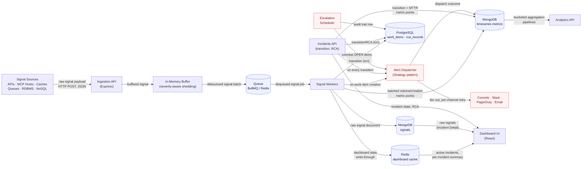

# InveniOps — Incident Management System (IMS)

## Overview

Distributed systems fail in pieces — a cache node degrades, a queue backs up, an RDBMS
connection pool exhausts — and each piece emits its own flood of error/latency signals
faster than a human can read them. InveniOps ingests those signals at high volume,
collapses repeated noise from the same failing component into a single trackable Work
Item, routes it to the right responder at the right severity, and enforces a workflow
that can't reach "Closed" without a documented root cause. The goal is to turn raw
signal noise into a small number of accountable incidents with a measurable
Mean Time To Repair.

## Architecture



See [docs/architecture.md](docs/architecture.md) for the write-path/read-path breakdown and
[docs/decisions/](docs/decisions/) for why each store holds what it holds.

## Tech stack

| Choice | Why | Main alternative rejected |
|---|---|---|
| Node.js 20 + TypeScript (strict) | Single-language stack, compile-time safety across API/domain/infra boundaries | Plain JavaScript — no compile-time guarantees on a codebase this layered |
| Express | Minimal, unopinionated HTTP layer with a mature middleware ecosystem (helmet, cors, pino-http) | Fastify — faster, but no functional need here outweighs Express's ubiquity and lower review friction |
| PostgreSQL 16 + Prisma | ACID transactions for work-item state transitions; typed schema and migrations | Raw `pg` + hand-written SQL — more control, no compile-time query safety, much more boilerplate |
| MongoDB 7 | Schemaless, high-throughput audit log for arbitrary raw signal payloads | Postgres JSONB column — would couple burst signal-write throughput to the transactional store |
| Redis 7 | Sub-millisecond hot-path reads for dashboard state; also backs the queue | In-process cache — doesn't survive restarts or scale past one instance |
| BullMQ | Redis-backed job queue; reuses infra already in the stack, built-in retry/backoff | RabbitMQ — a second broker to run and monitor with no capability this system needs that BullMQ lacks |
| React 18 + Vite + TypeScript + Tailwind | Fast dev loop, no build config, utility CSS with no library lock-in | Next.js — server-rendering/routing machinery this internal SPA doesn't need |
| Docker Compose | One-command reproducible local stack | Manually-installed host services — worse reproducibility for a reviewer |
| Vitest | Native ESM/TS, fast, same tool front and back | Jest — slower under ESM+TS, more config |
| zod | Runtime validation with inferred static types from one schema definition | Manual checks / Joi — no free TS type inference |
| pino | Structured JSON logs, low overhead, pairs directly with pino-http for request-id correlation | Winston — more configurable, slower, more boilerplate for structured output |

## Setup

**Prerequisites:** Docker Desktop (or a compatible engine) with Compose v2. Node.js 20+
only if you want to run `npm` commands outside Docker (editor tooling, `npm run dev`
against a containerized backend). `make` is optional — every target below has a raw
`docker compose` equivalent, since `make` isn't preinstalled on plain Windows.

**1. Environment**

```bash
cp .env.example .env
```

Optional — `docker-compose.yml` bakes in the same defaults, so the stack runs without
this step. Copy it if you want to override anything (ports, credentials, `VITE_API_BASE_URL`).

**2. Start the stack**

```bash
make up
# or, without make:
docker compose up -d --build
```

Brings up Postgres, Mongo, Redis, the backend API, and the frontend dev server. The
backend waits for all three data stores to report `healthy` before it starts (see
`depends_on: condition: service_healthy` in `docker-compose.yml`).

**3. Verify**

```bash
docker compose ps                        # all five services Up / healthy
curl http://localhost:3000/health         # {"status":"healthy","dependencies":{"postgres":"up","mongo":"up","redis":"up"}}
```

Open http://localhost:5173 — the connection indicator in the header should turn green
within a few seconds (it polls `/health` every 5s).

**Other targets:**

```bash
make logs        # docker compose logs -f
make down        # docker compose down
make reset       # docker compose down -v   (wipes all volumes — destructive)
make db-shell    # docker compose exec postgres psql -U <POSTGRES_USER> -d <POSTGRES_DB>
```

## Project structure

```
InveniOps/
├── backend/
│   ├── prisma/
│   │   └── schema.prisma        # Bootstrap-only: datasource/generator + a placeholder
│   │                             #   model, just enough to generate a client for /health.
│   │                             #   The real WorkItem/RcaRecord/StateTransition schema
│   │                             #   is designed (docs/decisions/) but not yet migrated.
│   ├── src/
│   │   ├── api/
│   │   │   ├── app.ts            # Express app: helmet, cors, body limit, request
│   │   │   │                     #   logging, error-handling middleware
│   │   │   └── routes/health.ts  # GET /health — per-dependency status
│   │   ├── config/                # zod-validated env config, frozen typed object
│   │   ├── domain/                # Pure business logic — empty until Phase 2
│   │   │                         #   (state machine, RCA validation, debouncer)
│   │   ├── repositories/          # Singleton Prisma/Mongo/Redis clients, graceful shutdown
│   │   ├── services/              # Orchestration layer — empty until Phase 2
│   │   ├── types/                  # Shared backend types — empty until the schema lands
│   │   ├── utils/                  # logger (pino), retry (backoff wrapper), metrics
│   │   ├── workers/                # BullMQ consumers — empty until Phase 2
│   │   └── index.ts                # Bootstrap: connect clients, start server, shutdown hooks
│   ├── tests/{unit,integration}/
│   └── Dockerfile                  # multi-stage: deps → build (prisma generate + tsc) → runtime
├── frontend/
│   ├── src/
│   │   ├── components/             # Reusable UI primitives (Header, ConnectionStatusIndicator)
│   │   ├── features/
│   │   │   ├── incidents/          # Live feed (/), detail view (/incidents/:id) — shells
│   │   │   └── rca/                # RCA form shell — not yet routed
│   │   ├── hooks/                  # useHealthStatus — polls /health every 5s
│   │   ├── lib/api.ts              # Typed fetch wrapper, error normalization
│   │   ├── types/                  # Mirrors backend contracts (health only, so far)
│   │   └── App.tsx                 # Router + app shell
│   └── Dockerfile                  # dev-mode: vite dev server, hot reload via bind mount
├── docs/
│   ├── assignment.md               # Original assignment spec
│   ├── architecture.md
│   └── decisions/                  # ADRs
├── prompts/                        # Prompts used to build this repo
├── scripts/                        # Sample data / load testing — empty until Phase 2
├── docker-compose.yml              # postgres, mongo, redis, backend, frontend
├── Makefile
└── .env.example
```

## Backpressure Handling

Full design writeup: [docs/backpressure.md](docs/backpressure.md).

**The problem.** The assignment requires absorbing bursts up to 10,000 signals/sec
without the system crashing when Postgres, Mongo, or Redis is momentarily slow.
`POST /api/v1/signals` therefore never touches any of those three on the request path —
it hands each signal to a bounded in-memory buffer
(`src/services/ingestion/buffer.ts`) and acks immediately; a BullMQ worker persists
asynchronously afterward.

**The ring buffer.** Four fixed-capacity circular buffers, one per severity (P0–P3),
each preallocated at the *full* configured capacity (`BUFFER_CAPACITY`, default
20,000) — not `capacity / 4` — so a legitimate single-severity flood still works
without resizing. A single shared invariant, enforced one level up, is what actually
bounds memory: `totalSize` across all four queues never exceeds `BUFFER_CAPACITY`, so
peak memory is a fixed constant regardless of arrival rate.

**Watermarks.** A high/low pair (0.8 / 0.5 by default) with hysteresis, not one
threshold — shedding turns on at the high mark and only turns back off once drained
below the low mark, so the buffer can't flap between states on every request near a
single boundary.

**Severity-aware shedding.** Below the high-water mark, no severity has a ceiling —
any one can grow to the full shared capacity. Once shedding engages, each *non-P0*
severity is additionally capped at a fraction of total capacity (P1 0.7, P2 0.4, P3
0.15 by default) — smallest for P3, largest for P1 — so low-severity signals run out of
their reserved room and get rejected first, in priority order, without any active
cross-queue eviction logic on the hot path. P0 is exempt from ceiling shedding
entirely; the only way a P0 signal is ever dropped is the separate, absolute
hard-capacity path (evicting the oldest lower-severity item to make room), which only
reaches P0 itself in the pathological case of 20,000 consecutive unconsumed P0s.

**What the caller sees.**

| Stage | Buffer state | Response |
|---|---|---|
| Normal | below the high-water mark | `202 { accepted, signalIds }` |
| Shedding | above high-water, a non-P0 signal beyond its severity's ceiling | `503 { error: "buffer_saturated", accepted, dropped }` — signals that *did* fit are still buffered |
| Hard capacity | buffer completely full | same `503 buffer_saturated` shape; a P0 evicts the oldest lower-severity item instead of being rejected |

Every drop is counted by severity and reason (`shed_ceiling` / `hard_capacity` /
`sink_failure`) and surfaced on `GET /health`, `GET /metrics`
(`ims_signals_dropped_total`), and the 5-second console line — no signal is ever
silently lost. A consumer loop drains batches in strict priority order into the BullMQ
queue, and a graceful-shutdown hook drains whatever's left before the process exits.

## API Reference

All bodies are JSON. `ComponentType` = `API | MCP_HOST | CACHE | QUEUE | RDBMS | NOSQL`.
`Severity` = `P0 | P1 | P2 | P3`. `WorkItemState` = `OPEN | INVESTIGATING | RESOLVED | CLOSED`.

### Signals — `src/api/routes/signals.ts`

| Method & path | Request | Response |
|---|---|---|
| `POST /api/v1/signals` | A single signal object or a JSON array of them: `{ signalId?, componentId, componentType, severity, rawPayload: any, occurredAt: ISO-8601 }` | `202 { accepted, signalIds? }` · `400 { error: "validation_error", details }` · `429 { error: "rate_limited" }` (+ `Retry-After`) · `503 { error: "buffer_saturated", accepted, dropped }` — see [Backpressure Handling](#backpressure-handling) |
| `POST /api/v1/signals/bulk-test` (disabled when `NODE_ENV=production`) | `{ count, componentId?, componentType?, severity? }` — generates synthetic signals in-process, for load testing without a separate generator | `202 { accepted }` · `400 validation_error` |

Every response carries `RateLimit-Limit` / `RateLimit-Remaining` / `RateLimit-Reset`
headers (per-IP token bucket, backed by Redis).

### Incidents (workflow) — `src/api/routes/workitems.ts`, mounted at `/api/v1/incidents`

`IncidentSummary`: `{ id, componentId, componentType, severity, state, title, firstSignalAt, signalCount, updatedAt }`

| Method & path | Request | Response |
|---|---|---|
| `GET /` | query `limit`, `offset` | `200 { items: IncidentSummary[], total, limit, offset }` — active (non-CLOSED) incidents, severity then age |
| `GET /:id` | — | `200` `IncidentSummary & { legalNextStates: WorkItemState[], rca: RcaSummaryDto \| null }` · `404 not_found` |
| `GET /:id/signals` | query `limit`, `offset` | `200 { items: SignalDto[], total, limit, offset }` — raw signals from Mongo, chronological · `404 not_found` |
| `POST /:id/transition` | `{ toState, actor }` | `200 IncidentSummary` · `404 not_found` · `409 invalid_transition` (illegal per the state machine) · `409 conflict` (optimistic-concurrency race) · `400 validation_error` |
| `POST /:id/rca` | `{ actor, incidentStartTime, incidentEndTime, rootCauseCategory, rootCauseDescription, fixApplied, preventionSteps }` | `200` `IncidentSummary & { mttrSeconds }` · `404 not_found` · `422 { error: "invalid_rca", errors: [{field,message}] }` · `409 invalid_state` (not currently RESOLVED) · `400 validation_error` |

`RcaSummaryDto`: `{ incidentStartTime, incidentEndTime, rootCauseCategory, rootCauseDescription, fixApplied, preventionSteps, mttrSeconds, submittedAt }`.
`rootCauseCategory` is one of `CODE_DEFECT | INFRASTRUCTURE_FAILURE | CONFIGURATION_ERROR | CAPACITY_EXHAUSTION | EXTERNAL_DEPENDENCY | NETWORK | HUMAN_ERROR | UNKNOWN`.

### Analytics — `src/api/routes/analytics.ts`, mounted at `/api/v1/analytics`

Full design: [docs/data-model.md](docs/data-model.md) (see "MongoDB — aggregation sink").
Every response is bucketed server-side (a MongoDB aggregation pipeline) — nothing is
fetched raw and summed in Node.

| Method & path | Request | Response |
|---|---|---|
| `GET /throughput` | `from`, `to` (ISO-8601), `interval` (seconds, default 60) | `200 { from, to, intervalSeconds, points: [{ bucket, componentId, severity, count }] }` |
| `GET /incidents` | `from`, `to`, `interval`, `groupBy=componentType\|severity` | `200 { ..., groupBy, points: [{ bucket, value, count }] }` |
| `GET /mttr` | `from`, `to`, `interval`, `groupBy=componentType\|severity` | `200 { ..., groupBy, points: [{ bucket, value, avgMttrMs, rollingAvgMttrMs, sampleCount }] }` — rolling average is a trailing 5-bucket window |
| `GET /components/:id` | query `windowSeconds` (default 3600) | `200 { componentId, windowSeconds, recentSignalCount, avgMttrMs, openWorkItemsByState }` |

All four return `400 validation_error` for a missing/malformed `from`/`to`/`interval`/`groupBy`.

### Observability — see [docs/observability.md](docs/observability.md) for full detail

| Method & path | Response |
|---|---|
| `GET /health` | `200` (all critical dependencies up) or `503` (one or more down) — per-dependency status/latency, buffer state, queue depth, uptime, version, throughput |
| `GET /ready` | `200` once the buffer drainer and BullMQ worker are actually running, `503` otherwise — distinct from `/health`, see docs/observability.md |
| `GET /metrics` | `200 text/plain` — Prometheus exposition format |

## Design Patterns

### State — work item lifecycle (`src/domain/state/`)

Each state (`OpenState`, `InvestigatingState`, `ResolvedState`, `ClosedState`) is a
class implementing `WorkItemState { transition(context), getLegalNextStates() }`,
extending `BaseWorkItemState`, which holds its legal transitions as a
`Map<WorkItemStateName, TransitionEntry>` — not a switch or an if/else chain. A
transition to a state that isn't in the map (or whose guard rejects it) throws
`InvalidTransitionError`; there is no other code path to CLOSED. `ResolvedState` is the
only state constructed with a guard — `createRcaCloseGuard`, which validates the RCA
payload and rejects the RESOLVED→CLOSED transition unless it's complete. This is the
literal mechanism behind CLOSED being unreachable without an RCA: it's enforced inside
`domain/state/`, not by the API layer choosing to check first (`WorkflowService` never
calls `submitRca`'s persistence path except through this guard — see
`tests/unit/services/workitems/workflowService.test.ts`, which calls the service
directly, with no HTTP layer involved, and proves the domain layer itself rejects it).

`createWorkItemStateGraph(canClose)` (`graph.ts`) wires the four states together —
`OpenState` is constructed with a reference to the `InvestigatingState` instance it can
transition to, and so on down the chain. **Adding a new state** (e.g. a
`REOPENED` state between CLOSED and OPEN) means: add the name to
`WorkItemStateName`, write one class extending `BaseWorkItemState` declaring what it
can transition to (with a guard, if the transition is conditional), and wire it into
`createWorkItemStateGraph`. No existing state class changes, and nothing outside
`domain/state/` does either — `WorkflowService`, the dashboard projection's
`legalNextStates`, and the API routes are all written against the `WorkItemState`
interface (`transition()`, `getLegalNextStates()`), never against a name or a switch.

### Strategy — alert severity/channel selection (`src/domain/alerting/`)

Every component type's alert policy (severity floor, channels, message text) is a
class implementing `AlertStrategy { componentType, severityFloor, buildAlert(context) }`
— see [docs/alerting.md](docs/alerting.md) for the full per-component table.
`AlertStrategyRegistry` resolves `componentType → AlertStrategy` via a `Map`, falling
back to `DefaultAlertStrategy` for anything unregistered — never a switch or
if/else on `componentType`, anywhere in this domain. **Adding a new component type**
means: write one class implementing `AlertStrategy`, and call
`registry.register(new MyStrategy())` once (in
`createDefaultAlertStrategyRegistry()`, or later at runtime). Zero edits to any
existing strategy, the registry class, `AlertDispatcher`, or `EscalationScheduler` — all
of them resolve through the same `registry.resolve(componentType)` call. This is
enforced, not just intended:
`tests/unit/domain/alerting/noBranchingOnComponentType.test.ts` statically scans every
file under `domain/alerting/` for a `switch` or an `if` on `componentType` and fails
the build if one appears — verified during development by deliberately introducing one
and confirming the test catches it, then reverting.

Both patterns share the same shape: a common interface, one class per concrete case,
and a lookup (a `Map`, injected constructor references) instead of conditional
dispatch — the thing that makes "add a new case" additive instead of a diff to
existing, already-tested code.

## Testing

**TODO:** expand beyond the current retry-wrapper unit tests (`backend/tests/unit/retry.test.ts`)
to cover the state machine, RCA validation, and debouncer once they exist; add
integration tests against the Dockerized stores.
