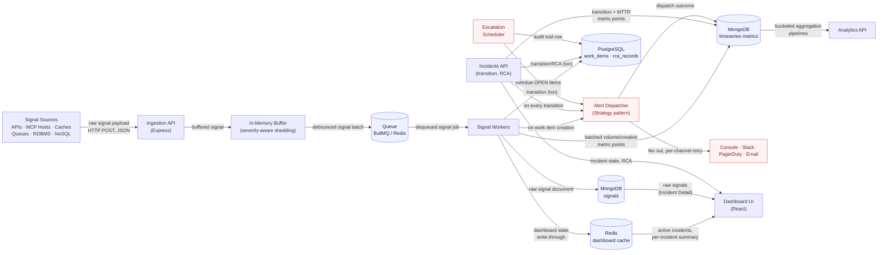
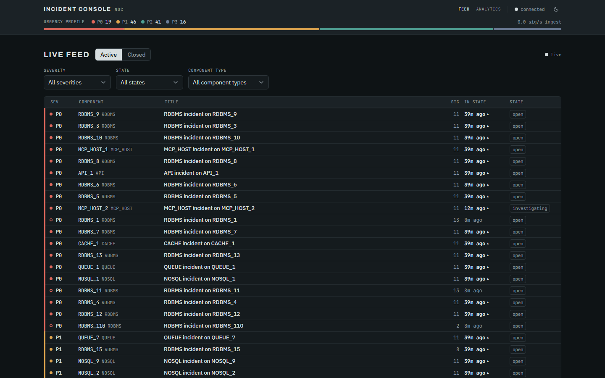
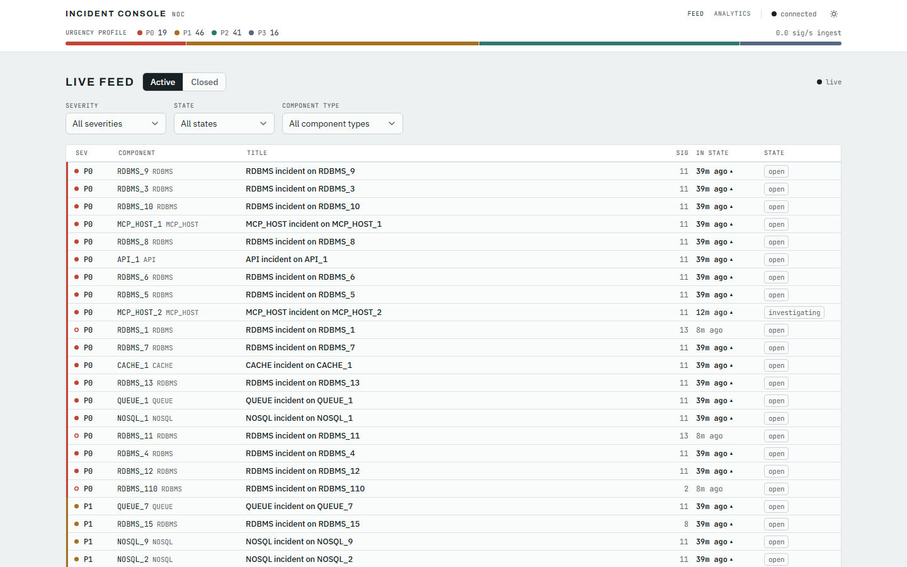
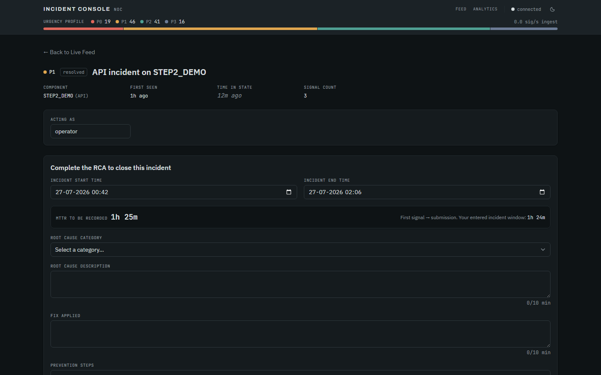
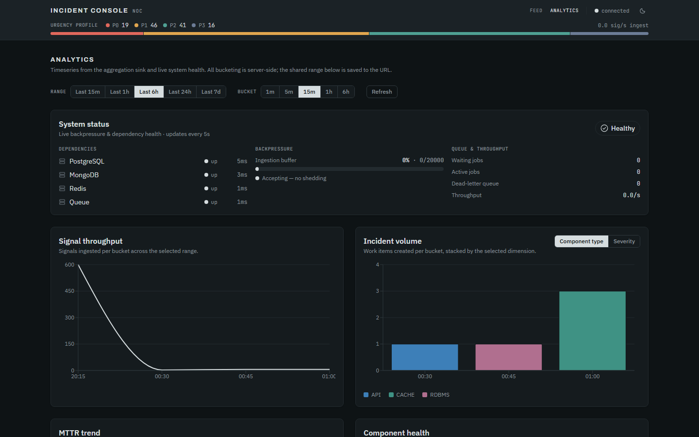

# InveniOps — Incident Management System (IMS)

## Overview

Distributed systems fail in pieces — a cache node degrades, a queue backs up, an RDBMS
connection pool exhausts — and each piece emits its own flood of error/latency signals
faster than a human can read them. InveniOps ingests those signals at high volume,
collapses repeated noise from the same failing component into a single trackable Work
Item, routes it to the right responder at the right severity, and enforces a workflow
that can't reach "Closed" without a documented root cause. The goal is to turn raw
signal noise into a small number of accountable incidents with a measurable
Mean Time To Repair.

## Architecture


```mermaid
graph LR
    Sources["Signal Sources<br/>APIs · MCP Hosts · Caches<br/>Queues · RDBMS · NoSQL"]
    Ingest["Ingestion API<br/>(Express)"]
    Buffer["In-Memory Buffer<br/>(severity-aware shedding)"]
    Queue[("Queue<br/>BullMQ / Redis")]
    Workers["Signal Workers"]
    Mongo[("MongoDB<br/>signals")]
    MongoMetrics[("MongoDB<br/>timeseries metrics")]
    Postgres[("PostgreSQL<br/>work_items · rca_records")]
    Redis[("Redis<br/>dashboard cache")]
    IncidentsAPI["Incidents API<br/>(transition, RCA)"]
    AnalyticsAPI["Analytics API"]
    AlertDispatcher["Alert Dispatcher<br/>(Strategy pattern)"]
    Escalation["Escalation<br/>Scheduler"]
    Channels["Console · Slack ·<br/>PagerDuty · Email"]
    Dashboard["Dashboard UI<br/>(React)"]

    Sources -->|"raw signal payload<br/>HTTP POST, JSON"| Ingest
    Ingest -->|"buffered signal"| Buffer
    Buffer -->|"debounced signal batch"| Queue
    Queue -->|"dequeued signal job"| Workers
    Workers -->|"raw signal document"| Mongo
    Workers -->|"Work Item + state<br/>transition (txn)"| Postgres
    Workers -->|"dashboard state<br/>write-through"| Redis
    Workers -->|"batched volume/creation<br/>metric points"| MongoMetrics
    Workers -->|"on work item creation"| AlertDispatcher
    IncidentsAPI -->|"transition/RCA (txn)"| Postgres
    IncidentsAPI -->|"on every transition"| AlertDispatcher
    IncidentsAPI -->|"transition + MTTR<br/>metric points"| MongoMetrics
    Escalation -->|"overdue OPEN items"| AlertDispatcher
    Escalation -->|"audit trail row"| Postgres
    AlertDispatcher -->|"fan out, per-channel retry"| Channels
    AlertDispatcher -->|"dispatch outcome"| MongoMetrics
    Redis -->|"active incidents,<br/>per-incident summary"| Dashboard
    Mongo -->|"raw signals<br/>(Incident Detail)"| Dashboard
    IncidentsAPI -->|"incident state, RCA"| Dashboard
    MongoMetrics -->|"bucketed aggregation<br/>pipelines"| AnalyticsAPI

    classDef store fill:#eef2ff,stroke:#6366f1,color:#1e1b4b;
    class Mongo,MongoMetrics,Postgres,Redis,Queue store;
    classDef alerting fill:#fef2f2,stroke:#ef4444,color:#7f1d1d;
    class AlertDispatcher,Escalation,Channels alerting;
```

See [docs/architecture.md](docs/architecture.md) for the write-path/read-path breakdown and
[docs/decisions/](docs/decisions/) for why each store holds what it holds.

## Tech stack

| Choice | Why | Main alternative rejected |
|---|---|---|
| Node.js 20 + TypeScript (strict) | Single-language stack, compile-time safety across API/domain/infra boundaries | Plain JavaScript — no compile-time guarantees on a codebase this layered |
| Express | Minimal, unopinionated HTTP layer with a mature middleware ecosystem (helmet, cors, pino-http) | Fastify — faster, but no functional need here outweighs Express's ubiquity and lower review friction |
| PostgreSQL 16 + Prisma | ACID transactions for work-item state transitions; typed schema and migrations | Raw `pg` + hand-written SQL — more control, no compile-time query safety, much more boilerplate |
| MongoDB 7 | Schemaless, high-throughput audit log for arbitrary raw signal payloads | Postgres JSONB column — would couple burst signal-write throughput to the transactional store |
| Redis 7 | Sub-millisecond hot-path reads for dashboard state; also backs the queue | In-process cache — doesn't survive restarts or scale past one instance |
| BullMQ | Redis-backed job queue; reuses infra already in the stack, built-in retry/backoff | RabbitMQ — a second broker to run and monitor with no capability this system needs that BullMQ lacks |
| React 18 + Vite + TypeScript + Tailwind | Fast dev loop, no build config, utility CSS with no library lock-in | Next.js — server-rendering/routing machinery this internal SPA doesn't need |
| Docker Compose | One-command reproducible local stack | Manually-installed host services — worse reproducibility for a reviewer |
| Vitest | Native ESM/TS, fast, same tool front and back | Jest — slower under ESM+TS, more config |
| zod | Runtime validation with inferred static types from one schema definition | Manual checks / Joi — no free TS type inference |
| pino | Structured JSON logs, low overhead, pairs directly with pino-http for request-id correlation | Winston — more configurable, slower, more boilerplate for structured output |

## Setup

**Prerequisites:** Docker Desktop (or a compatible engine) with Compose v2. Node.js 20+
only if you want to run `npm` commands outside Docker (editor tooling, `npm run dev`
against a containerized backend). `make` is optional — every target below has a raw
`docker compose` equivalent, since `make` isn't preinstalled on plain Windows.

**1. Environment**

```bash
cp .env.example .env
```

Optional — `docker-compose.yml` bakes in the same defaults, so the stack runs without
this step. Copy it if you want to override anything (ports, credentials, `VITE_API_BASE_URL`).

**2. Start the stack**

```bash
make up
# or, without make:
docker compose up -d --build
```

Brings up Postgres, Mongo, Redis, the backend API, and the frontend dev server. The
backend waits for all three data stores to report `healthy` before it starts (see
`depends_on: condition: service_healthy` in `docker-compose.yml`).

**3. Verify**

```bash
docker compose ps                        # all five services Up / healthy
curl http://localhost:3000/health         # {"status":"healthy","dependencies":{"postgres":"up","mongo":"up","redis":"up"}}
```

Open http://localhost:5173 — the connection indicator in the header should turn green
within a few seconds (it polls `/health` every 5s).

**Other targets:**

```bash
make logs        # docker compose logs -f
make down        # docker compose down
make reset       # docker compose down -v   (wipes all volumes — destructive)
make db-shell    # docker compose exec postgres psql -U <POSTGRES_USER> -d <POSTGRES_DB>
```

## Project structure

```
InveniOps/
├── backend/
│   ├── prisma/
│   │   └── schema.prisma        # Bootstrap-only: datasource/generator + a placeholder
│   │                             #   model, just enough to generate a client for /health.
│   │                             #   The real WorkItem/RcaRecord/StateTransition schema
│   │                             #   is designed (docs/decisions/) but not yet migrated.
│   ├── src/
│   │   ├── api/
│   │   │   ├── app.ts            # Express app: helmet, cors, body limit, request
│   │   │   │                     #   logging, error-handling middleware
│   │   │   └── routes/health.ts  # GET /health — per-dependency status
│   │   ├── config/                # zod-validated env config, frozen typed object
│   │   ├── domain/                # Pure business logic — empty until Phase 2
│   │   │                         #   (state machine, RCA validation, debouncer)
│   │   ├── repositories/          # Singleton Prisma/Mongo/Redis clients, graceful shutdown
│   │   ├── services/              # Orchestration layer — empty until Phase 2
│   │   ├── types/                  # Shared backend types — empty until the schema lands
│   │   ├── utils/                  # logger (pino), retry (backoff wrapper), metrics
│   │   ├── workers/                # BullMQ consumers — empty until Phase 2
│   │   └── index.ts                # Bootstrap: connect clients, start server, shutdown hooks
│   ├── tests/{unit,integration}/
│   └── Dockerfile                  # multi-stage: deps → build (prisma generate + tsc) → runtime
├── frontend/
│   ├── src/
│   │   ├── components/             # Reusable UI primitives (Header, ConnectionStatusIndicator)
│   │   ├── features/
│   │   │   ├── incidents/          # Live feed (/), detail view (/incidents/:id) — shells
│   │   │   └── rca/                # RCA form shell — not yet routed
│   │   ├── hooks/                  # useHealthStatus — polls /health every 5s
│   │   ├── lib/api.ts              # Typed fetch wrapper, error normalization
│   │   ├── types/                  # Mirrors backend contracts (health only, so far)
│   │   └── App.tsx                 # Router + app shell
│   └── Dockerfile                  # dev-mode: vite dev server, hot reload via bind mount
├── docs/
│   ├── assignment.md               # Original assignment spec
│   ├── architecture.md
│   └── decisions/                  # ADRs
├── prompts/                        # Prompts used to build this repo
├── scripts/                        # Sample data / load testing — empty until Phase 2
├── docker-compose.yml              # postgres, mongo, redis, backend, frontend
├── Makefile
└── .env.example
```

## Backpressure Handling

Full design writeup: [docs/backpressure.md](docs/backpressure.md). For load-test
methodology, the measured baseline, and a documented tuning pass on top of it, see
[docs/performance.md](docs/performance.md).

**The problem.** The assignment requires absorbing bursts up to 10,000 signals/sec
without the system crashing when Postgres, Mongo, or Redis is momentarily slow.
`POST /api/v1/signals` therefore never touches any of those three on the request path —
it hands each signal to a bounded in-memory buffer
(`src/services/ingestion/buffer.ts`) and acks immediately; a BullMQ worker persists
asynchronously afterward.

**The ring buffer.** Four fixed-capacity circular buffers, one per severity (P0–P3),
each preallocated at the *full* configured capacity (`BUFFER_CAPACITY`, default
20,000) — not `capacity / 4` — so a legitimate single-severity flood still works
without resizing. A single shared invariant, enforced one level up, is what actually
bounds memory: `totalSize` across all four queues never exceeds `BUFFER_CAPACITY`, so
peak memory is a fixed constant regardless of arrival rate.

**Watermarks.** A high/low pair (0.8 / 0.5 by default) with hysteresis, not one
threshold — shedding turns on at the high mark and only turns back off once drained
below the low mark, so the buffer can't flap between states on every request near a
single boundary.

**Severity-aware shedding.** Below the high-water mark, no severity has a ceiling —
any one can grow to the full shared capacity. Once shedding engages, each *non-P0*
severity is additionally capped at a fraction of total capacity (P1 0.7, P2 0.4, P3
0.15 by default) — smallest for P3, largest for P1 — so low-severity signals run out of
their reserved room and get rejected first, in priority order, without any active
cross-queue eviction logic on the hot path. P0 is exempt from ceiling shedding
entirely; the only way a P0 signal is ever dropped is the separate, absolute
hard-capacity path (evicting the oldest lower-severity item to make room), which only
reaches P0 itself in the pathological case of 20,000 consecutive unconsumed P0s.

**What the caller sees.**

| Stage | Buffer state | Response |
|---|---|---|
| Normal | below the high-water mark | `202 { accepted, signalIds }` |
| Shedding | above high-water, a non-P0 signal beyond its severity's ceiling | `503 { error: "buffer_saturated", accepted, dropped }` — signals that *did* fit are still buffered |
| Hard capacity | buffer completely full | same `503 buffer_saturated` shape; a P0 evicts the oldest lower-severity item instead of being rejected |

Every drop is counted by severity and reason (`shed_ceiling` / `hard_capacity` /
`sink_failure`) and surfaced on `GET /health`, `GET /metrics`
(`ims_signals_dropped_total`), and the 5-second console line — no signal is ever
silently lost. A consumer loop drains batches in strict priority order into the BullMQ
queue, and a graceful-shutdown hook drains whatever's left before the process exits.

## API Reference

All bodies are JSON. `ComponentType` = `API | MCP_HOST | CACHE | QUEUE | RDBMS | NOSQL`.
`Severity` = `P0 | P1 | P2 | P3`. `WorkItemState` = `OPEN | INVESTIGATING | RESOLVED | CLOSED`.

### Signals — `src/api/routes/signals.ts`

| Method & path | Request | Response |
|---|---|---|
| `POST /api/v1/signals` | A single signal object or a JSON array of them: `{ signalId?, componentId, componentType, severity, rawPayload: any, occurredAt: ISO-8601 }` | `202 { accepted, signalIds? }` · `400 { error: "validation_error", details }` · `429 { error: "rate_limited" }` (+ `Retry-After`) · `503 { error: "buffer_saturated", accepted, dropped }` — see [Backpressure Handling](#backpressure-handling) |
| `POST /api/v1/signals/bulk-test` (disabled when `NODE_ENV=production`) | `{ count, componentId?, componentType?, severity? }` — generates synthetic signals in-process, for load testing without a separate generator | `202 { accepted }` · `400 validation_error` |

Every response carries `RateLimit-Limit` / `RateLimit-Remaining` / `RateLimit-Reset`
headers (per-IP token bucket, backed by Redis).

### Incidents (workflow) — `src/api/routes/workitems.ts`, mounted at `/api/v1/incidents`

`IncidentSummary`: `{ id, componentId, componentType, severity, state, title, firstSignalAt, signalCount, updatedAt }`

| Method & path | Request | Response |
|---|---|---|
| `GET /` | query `limit`, `offset`, `status=active\|closed` (default `active`) | `200 { items: IncidentSummary[], total, limit, offset }` — `active`: non-CLOSED incidents, severity then age (from the Redis cache); `closed`: CLOSED incidents, most-recently-closed first (from Postgres) |
| `GET /:id` | — | `200` `IncidentSummary & { legalNextStates: WorkItemState[], rca: RcaSummaryDto \| null }` · `404 not_found` |
| `GET /:id/signals` | query `limit`, `offset` | `200 { items: SignalDto[], total, limit, offset }` — raw signals from Mongo, chronological · `404 not_found` |
| `POST /:id/transition` | `{ toState, actor }` | `200 IncidentSummary` · `404 not_found` · `409 invalid_transition` (illegal per the state machine) · `409 conflict` (optimistic-concurrency race) · `400 validation_error` |
| `POST /:id/rca` | `{ actor, incidentStartTime, incidentEndTime, rootCauseCategory, rootCauseDescription, fixApplied, preventionSteps }` | `200` `IncidentSummary & { mttrSeconds }` · `404 not_found` · `422 { error: "invalid_rca", errors: [{field,message}] }` · `409 invalid_state` (not currently RESOLVED) · `400 validation_error` |

`RcaSummaryDto`: `{ incidentStartTime, incidentEndTime, rootCauseCategory, rootCauseDescription, fixApplied, preventionSteps, mttrSeconds, submittedAt }`.
`rootCauseCategory` is one of `CODE_DEFECT | INFRASTRUCTURE_FAILURE | CONFIGURATION_ERROR | CAPACITY_EXHAUSTION | EXTERNAL_DEPENDENCY | NETWORK | HUMAN_ERROR | UNKNOWN`.

### Analytics — `src/api/routes/analytics.ts`, mounted at `/api/v1/analytics`

Full design: [docs/data-model.md](docs/data-model.md) (see "MongoDB — aggregation sink").
Every response is bucketed server-side (a MongoDB aggregation pipeline) — nothing is
fetched raw and summed in Node.

| Method & path | Request | Response |
|---|---|---|
| `GET /throughput` | `from`, `to` (ISO-8601), `interval` (seconds, default 60) | `200 { from, to, intervalSeconds, points: [{ bucket, componentId, severity, count }] }` |
| `GET /incidents` | `from`, `to`, `interval`, `groupBy=componentType\|severity` | `200 { ..., groupBy, points: [{ bucket, value, count }] }` |
| `GET /mttr` | `from`, `to`, `interval`, `groupBy=componentType\|severity` | `200 { ..., groupBy, points: [{ bucket, value, avgMttrMs, rollingAvgMttrMs, sampleCount }] }` — rolling average is a trailing 5-bucket window |
| `GET /components/:id` | query `windowSeconds` (default 3600) | `200 { componentId, windowSeconds, recentSignalCount, avgMttrMs, openWorkItemsByState }` |

All four return `400 validation_error` for a missing/malformed `from`/`to`/`interval`/`groupBy`.

### Observability — see [docs/observability.md](docs/observability.md) for full detail

| Method & path | Response |
|---|---|
| `GET /health` | `200` (all critical dependencies up) or `503` (one or more down) — per-dependency status/latency, buffer state, queue depth, uptime, version, throughput |
| `GET /ready` | `200` once the buffer drainer and BullMQ worker are actually running, `503` otherwise — distinct from `/health`, see docs/observability.md |
| `GET /metrics` | `200 text/plain` — Prometheus exposition format |

## Frontend (UI)

React 18 + TypeScript + Vite + Tailwind, in [`frontend/`](frontend/). A dense,
responsive operator dashboard that drives the whole incident lifecycle against
the APIs above. Every route is a lazily-loaded chunk wrapped in an error
boundary, so one screen failing degrades to a recoverable card, never a white
page.

### Design system

**The brief: a NOC panel read at 3am by an on-call engineer who just got
paged.** One job — show what's broken, how bad, and how long, scannable in
under three seconds — which drove every decision below. Full rationale:
[ADR 0008](docs/decisions/0008-console-visual-system.md). Tokens live in the
`@theme` layer of [`frontend/src/index.css`](frontend/src/index.css).

**Palette — colour rationed to severity, nothing else.** Every hue in the
system is fully desaturated/darkened from a normal UI palette *except* the
four severity swatches, so a glance at colour alone means "how bad" and
nothing competes with it — no colourful buttons, no cheerful success-green,
no brand blue. Two parallel palettes, not one flipped: dark **"instrument
slate"** is the primary mode (`#0e1315` panel, `#d6dddf` ink), and light
**"daylight triage"** is a first-class alternative in cool greys (`#eef1f2`
panel), never the cream/warm-white a light mode defaults to by habit. Severity
splits warm-vs-cool by urgency tier — P0/P1 (act now) are warm red/amber, P2/P3
(be aware) are cool teal/slate — so the *temperature* of a row is legible
even before reading the code, and the same four hues drive the row spine, the
age dot, the header's urgency ribbon, and the analytics charts from one source
(`components/severity.ts`) so they can never drift apart. Every text/colour
pairing in both themes is audited against WCAG AA (4.5:1 for real text, 3:1
for graphical elements like the spine/dots) — see the ADR for the two
contrast bugs the audit caught and how they were fixed without losing the
"three ink tiers" hierarchy.

**Type — a three-face system that tells machine from human at a glance.**
Archivo for equipment-style labels (tracked, uppercase — the wordmark and page
headings), IBM Plex Sans for human prose (titles, RCA narrative, empty/error
copy), JetBrains Mono for every machine-generated value — component/signal
IDs, timestamps, counts, raw JSON — with tabular figures so numbers align in
a column. Seven named type-scale rungs (`eyebrow` through `mono-micro`, all
defined in `index.css`'s `@theme` block and demoed live on `/styleguide`) mean
no component ever reaches for an arbitrary `text-[13px]` — it picks the rung
that matches its job.

**Density & signature — the severity spine.** Feed rows run roughly 1.7× the
density of a typical list row (`~28px`), because an operator scanning fifty
active incidents needs the whole picture on one screen, not five scrolls. The
signature element is a 3px colour rail on each row's leading edge; because
rows abut with no divider, a severity-sorted feed reads as one continuous
ribbon rather than fifty individual coloured chips. An **age dot** in the same
gutter answers "how long" — hollow while fresh, filled once an incident has
sat unaddressed past a threshold — and "time in state" separately escalates by
ink weight, never a second colour, so severity and staleness never blur into
each other.

|  |  |
|---|---|
|  |  |
| **Dark** — "instrument slate," the default | **Light** — "daylight triage," a first-class alternative, not a flip |

Every reusable primitive in every state — badges, buttons, form fields, the
full type scale, the severity spine on real data — is catalogued at
[`/styleguide`](frontend/src/features/styleguide/StyleGuidePage.tsx). It's a
**development artifact, not a product surface**: intentionally not linked
from the primary nav (an on-call engineer never needs it at 3am), reachable
only by typing the URL, and it exists so the visual system can be reviewed and
regression-checked independent of any one screen.

### Routes

| Route | Screen | What it does |
|---|---|---|
| `/` | **Live Feed** | Active incidents, severity-then-recency (server-sorted). Real-time via SSE with a polling fallback; client-side filters (severity/state/component type) persisted in the URL; pagination; time-in-state that visually escalates as it grows. An **Active / Closed** toggle (`?view=closed`) switches to the closed-incident **history** — server-paginated (via `GET /api/v1/incidents?status=closed`), most-recently-closed first, since closed incidents leave the active cache once RCA'd. |
| `/incidents/:id` | **Incident Detail** | Header + state-machine controls rendered from the server's `legalNextStates` (the domain layer stays authoritative); transition timeline; raw signals from Mongo, paginated & load-on-demand, newest/oldest with expandable payloads. Handles 409-conflict, RCA-required, and not-found explicitly. |
| `/analytics` | **Analytics** | Throughput, incident volume (stacked, by type/severity), MTTR trend with the server's rolling average overlaid, and a worst-first component-health table — all from the aggregation endpoints, with a shared URL-persisted range/bucket selector. Plus a live **System Status** panel (per-dependency latency, buffer fill, queue depth, shedding state) that makes the backpressure work visible. |
| `/styleguide` | **Style Guide** | Every reusable primitive in every state — the visual system the dashboard is built from. |

### The workflow

Feed → click an incident → **Start investigating** → **Mark resolved** →
**Complete the RCA** (both timestamps, category, and the three narrative
fields, client-validated as a mirror of the backend domain rules) → submit →
the incident closes and the page re-renders as the read-only RCA with the
computed MTTR. The RCA form previews the MTTR it's about to record, counts
characters toward the minimums, persists a draft to `sessionStorage`, and warns
on navigating away with unsaved changes.

| | |
|---|---|
|  |  |
| **Live Feed** — severity counts, escalating time-in-state, real-time updates | **Incident Detail** — state controls, transition timeline, raw signals, and (once RESOLVED) the RCA form with its live MTTR preview |
|  | |
| **Analytics** — throughput, volume, MTTR trend, component health, live system status | |

### Resilience & accessibility

- **Backend unreachable** → a shell-level banner (header/nav stay usable), and
  a single `/health` poller retries automatically with exponential backoff
  (5s → 30s). **Shedding under backpressure** surfaces as a distinct
  "system under load" banner, not a generic outage; a dependency outage shows
  which dependency is down.
- **Real-time transport** is SSE, with a documented rationale in
  [ADR 0007](docs/decisions/0007-sse-for-real-time-transport.md). SSE drops
  degrade to polling with a subtle indicator so the operator always knows how
  fresh the data is. Live updates never re-mount the list; rows are memoized by
  value so a refresh repaints only what actually changed.
- Skeletons appear only after ~200ms to avoid flicker; every fetch is
  cancellable and aborted on unmount.
- Keyboard-navigable through the full workflow with a visible focus ring
  throughout — always the neutral `ring-ink` token, never a severity hue, so
  focus stays visible against every surface in both themes
  (11.7:1+ dark / 14.4:1+ light); `header`/`nav`/`main` landmarks, one `h1`
  per screen, a skip-to-content link, and `aria-current` on the active nav
  item. No meaning is carried by colour alone (severity is always paired
  with its mono code; state carries no colour at all; charts always carry
  legends and labels). Chart palettes are validated for colour-vision-
  deficiency separation.
- **Every text/background pairing meets WCAG AA** (4.5:1 text, 3:1
  graphical), in both themes, checked with a contrast script rather than
  eyeballed — see [ADR 0008](docs/decisions/0008-console-visual-system.md)
  for the one real failure it caught (`ink-faint` used as label text) and how
  it was fixed without flattening the three-tier ink hierarchy.
- Responsive at **375 / 768 / 1440px** — tables collapse to cards on narrow
  viewports, charts reflow, no horizontal overflow. Re-checked specifically
  against the denser feed-row layout, since a tighter row breaks differently
  than a sparse one.

### Running the frontend standalone

The frontend reads its API base URL from `VITE_API_BASE_URL` (default
`http://localhost:3000`).

```bash
cd frontend
npm install

# dev server with hot reload (http://localhost:5173)
npm run dev

# type-check + production build, then serve the built bundle (http://localhost:4173)
npm run build
npm run preview

# point at a non-default backend
VITE_API_BASE_URL=http://api.example.com npm run dev

# unit/component tests (RCA validation + form behaviour)
npm test
```

Under Docker Compose the `frontend` service runs the Vite dev server against a
bind-mounted source tree (hot reload), with `VITE_API_BASE_URL` supplied by
compose — no separate step needed beyond `docker compose up`.

## Design Patterns

### State — work item lifecycle (`src/domain/state/`)

Each state (`OpenState`, `InvestigatingState`, `ResolvedState`, `ClosedState`) is a
class implementing `WorkItemState { transition(context), getLegalNextStates() }`,
extending `BaseWorkItemState`, which holds its legal transitions as a
`Map<WorkItemStateName, TransitionEntry>` — not a switch or an if/else chain. A
transition to a state that isn't in the map (or whose guard rejects it) throws
`InvalidTransitionError`; there is no other code path to CLOSED. `ResolvedState` is the
only state constructed with a guard — `createRcaCloseGuard`, which validates the RCA
payload and rejects the RESOLVED→CLOSED transition unless it's complete. This is the
literal mechanism behind CLOSED being unreachable without an RCA: it's enforced inside
`domain/state/`, not by the API layer choosing to check first (`WorkflowService` never
calls `submitRca`'s persistence path except through this guard — see
`tests/unit/services/workitems/workflowService.test.ts`, which calls the service
directly, with no HTTP layer involved, and proves the domain layer itself rejects it).

`createWorkItemStateGraph(canClose)` (`graph.ts`) wires the four states together —
`OpenState` is constructed with a reference to the `InvestigatingState` instance it can
transition to, and so on down the chain. **Adding a new state** (e.g. a
`REOPENED` state between CLOSED and OPEN) means: add the name to
`WorkItemStateName`, write one class extending `BaseWorkItemState` declaring what it
can transition to (with a guard, if the transition is conditional), and wire it into
`createWorkItemStateGraph`. No existing state class changes, and nothing outside
`domain/state/` does either — `WorkflowService`, the dashboard projection's
`legalNextStates`, and the API routes are all written against the `WorkItemState`
interface (`transition()`, `getLegalNextStates()`), never against a name or a switch.

### Strategy — alert severity/channel selection (`src/domain/alerting/`)

Every component type's alert policy (severity floor, channels, message text) is a
class implementing `AlertStrategy { componentType, severityFloor, buildAlert(context) }`
— see [docs/alerting.md](docs/alerting.md) for the full per-component table.
`AlertStrategyRegistry` resolves `componentType → AlertStrategy` via a `Map`, falling
back to `DefaultAlertStrategy` for anything unregistered — never a switch or
if/else on `componentType`, anywhere in this domain. **Adding a new component type**
means: write one class implementing `AlertStrategy`, and call
`registry.register(new MyStrategy())` once (in
`createDefaultAlertStrategyRegistry()`, or later at runtime). Zero edits to any
existing strategy, the registry class, `AlertDispatcher`, or `EscalationScheduler` — all
of them resolve through the same `registry.resolve(componentType)` call. This is
enforced, not just intended:
`tests/unit/domain/alerting/noBranchingOnComponentType.test.ts` statically scans every
file under `domain/alerting/` for a `switch` or an `if` on `componentType` and fails
the build if one appears — verified during development by deliberately introducing one
and confirming the test catches it, then reverting.

Both patterns share the same shape: a common interface, one class per concrete case,
and a lookup (a `Map`, injected constructor references) instead of conditional
dispatch — the thing that makes "add a new case" additive instead of a diff to
existing, already-tested code.

## Testing

**Unit tests** (`backend/tests/unit/`, `npm test`): 363 tests, zero I/O, run in a few
seconds. Coverage is enforced, not just reported — `vitest.config.ts` sets a
threshold (currently 85% statements/lines, 90% branches, 78% functions) scoped to
`src/domain/**`, `src/services/**`, and the retry util, and a plain `npm test` fails
the run if actual coverage drops below it. The two areas the rubric names explicitly
are both at 100%:

- **RCA validation** (`domain/rca/validateRca.test.ts`) — every rule, both a passing
  and failing case; boundary cases (exactly-at-minimum text length, end time one
  second after/equal to start, start time exactly at `firstSignalAt`, timestamps one
  second in the future); every `RootCauseCategory` enum member accepted, an invalid
  one rejected; multiple simultaneous failures return every field error, not just the
  first.
- **Retry logic** (`utils/retry.test.ts`, `repositories/postgres/{prismaErrors,withPostgresRetry}.test.ts`)
  — succeeds first try / after N transient failures / exhausts and throws; exponential
  backoff timing and jitter (asserted against the actual random draw, not just "some
  number in range"); every Prisma error code the retry wrapper classifies, tested
  individually — connection failure (P1001), deadlock/serialization conflict (P2034),
  and pool timeout (P2024) retry; constraint violation (P2002), not-found (P2025), and
  validation errors do not.

Also at 100%: the **work item state machine** (every legal transition, every illegal
transition via the full cross-product of states, CLOSED's terminal-ness, and
`getLegalNextStates` for all four states) and **alert strategy resolution** (the
`AlertStrategyRegistry` lookup plus every per-component-type strategy). The
**debouncer** (`services/ingestion/debouncer.test.ts`) — previously exercised only by
the slow, real-Redis/Postgres/Mongo integration test below — now also has a fast unit
suite against fake stores covering the create/link/race/lock-contention/cache-staleness
paths individually. The **ingestion buffer**'s interval-driven drain loop
(`start`/`stop`/`setSink`, tick reentrancy, surviving a failing tick) is covered the
same way.

Deliberately left to the integration suite rather than mocked: `src/repositories/**`'s
actual Prisma/Mongo/Redis calls, and the I/O-heavy alert dispatch/escalation
orchestration — those are thin wrappers around real clients, and a unit test against a
mocked ORM would mostly assert that the mock does what the mock was told to do.

**Integration tests** (`backend/tests/integration/`, `npm run test:integration`,
requires the Dockerized stores running): the debouncer's real Postgres-unique-index
correctness under actual concurrency (60 simultaneous signals × 8 iterations, exactly
one work item every time), the full ingest→debounce→alert→dashboard-cache pipeline,
repository round-trips against real Postgres/Mongo, the rate limiter, and the SSE event
bus.

**E2E tests** (`backend/tests/e2e/`, `npm run test:e2e`, requires the real
docker-compose stack running): full-lifecycle correctness against the actually
deployed backend over its real HTTP API — 500 signals across 5 components collapsing
into 5 work items (not 500), correct Mongo linkage, alerting-Strategy severity
reconciliation, dashboard-cache-vs-Postgres consistency, the full
OPEN→INVESTIGATING→RESOLVED→CLOSED lifecycle with RCA validation and MTTR, and a
concurrency test firing 50 simultaneous transitions at one work item across 25
iterations to prove exactly one ever wins.

**Chaos / resilience tests** (`backend/tests/chaos/`, `npm run test:chaos`, requires
the real docker-compose stack running, ~1.5-3 min): pauses, stops, and kills the real
containers — Postgres outage, Redis outage, slow Mongo, queue saturation, a mid-job
worker crash, and a graceful-shutdown drain — asserting concrete data-integrity
outcomes, not just "didn't crash." Full write-up: `backend/tests/chaos/README.md`.

**CI** (`.github/workflows/ci.yml`): lint, typecheck, unit tests (coverage-gated),
frontend typecheck/tests, then integration + E2E + a short load test with a
throughput-regression floor, all against the real stack — on every push and PR. The
chaos suite runs on manual trigger only (`workflow_dispatch`), not on every push; the
workflow file documents why (disruptive by design, and genuinely variable runtime, not
a fit for a PR gate).

## Sample Data

The assignment asks for "a script or JSON file to mock a failure event across the
stack (e.g., simulating an RDBMS outage followed by an MCP failure)." `scripts/scenarios/`
has both: a narrated, replayable **cascading failure** scenario, and a companion
script that walks the resulting incidents through the full lifecycle to `CLOSED` —
so opening [the dashboard](http://localhost:5173) afterward shows a realistic mix of
active and closed incidents with real MTTR values, not an empty analytics page.

### Running it

```bash
docker compose up -d             # from the repo root, if not already running

cd scripts/scenarios
npm install                                # one-time

npm run cascading-failure                  # real time — ~3 minutes, for a live demo
npm run cascading-failure -- --speed 30    # compressed — ~10 seconds, for CI

npm run replay-lifecycle                   # then this — closes the incident work items
```

Both scripts talk to the real, running stack over the real HTTP API
(`http://localhost:3000` by default, `--api-url` to override) — no in-process
shortcuts. `--speed` divides every wait in the timeline by that factor: `--speed 1`
(the default) plays out exactly as narrated in real time; `--speed 30` produces the
same event sequence, in the same order, at the same volumes, in about ten seconds.
Both are safe to re-run against the same stack — componentIds are fixed, so each run
reads a component's pre-existing signal count first and only asserts against what
*that run itself* added.

### `cascading-failure.ts` / `cascading-failure.json`

`cascading-failure.json` is the canonical, static event sequence — inspectable
without running anything. `cascading-failure.ts` reads it at runtime and replays it
exactly as written, narrating each beat to the console as it fires:

| T+ | Beat | What happens |
|---|---|---|
| 0s | Baseline | Low-severity background traffic across all 6 component types |
| 30s | RDBMS primary begins failing | Connection pool exhaustion on `DB_PRIMARY_01`, ramping 1/s → 10/s over 15s |
| 45s | Dependent APIs time out | Three API components report timeouts as the DB backs up |
| 60s | MCP host fails | `MCP_HOST_01` fails as its downstream dependency degrades |
| 75s | Cache miss storm | `CACHE_SESSION_01` ramps 2/s → 12/s as services fall back to the (failing) DB |
| 120s | Partial recovery | Every previously-failing component's error rate declines |
| 180s | Steady state restored | No new signals |

Once the timeline finishes, the script verifies — against the real system, not
inferred — every property the assignment asks this scenario to demonstrate:

- **Debouncing collapsed the RDBMS burst into one work item**: polls Postgres
  directly until each component's `work_items` row shows the expected `signal_count`,
  and confirms the 83 RDBMS signals from the ramp (86 including the recovery beat)
  collapsed into exactly **one** work item — enforced by
  `idx_work_items_active_component_id`, not just the Redis debounce fast path.
- **The alerting Strategy assigned P0 to RDBMS and lower severities elsewhere**: the
  RDBMS beat deliberately *reports* P1 (a monitor under-calling a connection-pool
  warning — realistic), specifically so this can prove the Strategy's severity
  *floor* is doing real work, not just echoing what was sent. It greps the backend's
  own logs for the dispatched `ALERT [...]` line and confirms RDBMS's alert was
  corrected up to **P0**, while the API/MCP_HOST/CACHE alerts — which already
  reported at their own floor — pass through unchanged.
- **Signals were correctly linked to their work items**: the same per-component
  `signal_count` check, run for all 12 components (6 failing, 6 healthy baseline).
- **The buffer absorbed the burst without loss**: every `POST /api/v1/signals`
  response is tallied; the run reports 0 signals dropped (503) across the whole
  scenario. (A fast `--speed` run can genuinely trip the real per-IP rate limiter —
  the script retries those like any well-behaved client would, honoring
  `Retry-After`, and reports the retry count separately from actual data loss.)

Verification uses direct, read-only Postgres access and `docker logs`, the same
posture as `backend/tests/chaos/`'s helpers, because there's no — and shouldn't be a
— "find the work item for this componentId" HTTP endpoint; every signal and every
state transition still goes through the real API. Each run writes
`scripts/scenarios/.output/last-run.json` (gitignored) recording the componentId →
work item ID mapping, which the companion script below reads.

### `replay-lifecycle.ts`

Reads `.output/last-run.json` and walks every **incident** work item (the 6 from the
failure narrative — not the 6 healthy baseline ones) through
`OPEN → INVESTIGATING → RESOLVED →` a real RCA (`POST /:id/rca`, which validates and
closes it in one step), printing the computed MTTR for each. The RCA content is
tailored per component type and passes the real `validateRca` rules, not placeholder
text; `incidentStartTime` is the work item's actual `firstSignalAt`, so the reported
MTTR is the real elapsed time, not a fabricated one.

The 6 baseline work items are left `OPEN` on purpose — so the dashboard shows both
still-active incidents (baseline) and closed ones with real MTTR (the cascading
failure), exercising both halves of the UI and giving the analytics/MTTR views real
closed data to chart.
